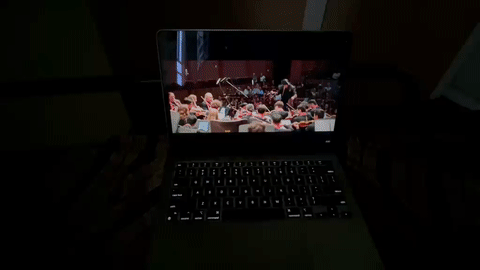

# 🎹 Keyboard Strobe

  

> **Turn your MacBook's keyboard backlight into a zero-latency, beat-synced strobe light!**

`keyboard-strobe` is a high-performance command-line utility for macOS that captures direct system audio and flashes your MacBook keyboard's backlight in perfect sync with the beats of your music. It is built in native Swift and leverages Apple's **ScreenCaptureKit** to stream internal mixer audio directly—bypassing the microphone entirely and ignoring ambient room noise.

---

## 🎥 Demos

*Click to play the demo clips below:*

https://github.com/ZANYANBU/keyboard-strobe/raw/main/demos/demo1.mp4

https://github.com/ZANYANBU/keyboard-strobe/raw/main/demos/demo2.mp4

---

## ✨ Features

- **⚡ Zero-Latency Response:** Captures and processes internal system audio streams directly, syncing key flashes perfectly with the sound reaching your ears.
- **🔊 Dual-Band Beat Detection:** Employs a digital signal processing (DSP) engine to isolate and detect:
  - **Bass kicks:** Using a low-pass filter ($fc \approx 120\text{ Hz}$).
  - **Snare drums, claps, and vocal transients:** Using a high-pass filter ($fc \approx 1200\text{ Hz}$).
- **🎛️ Onset Detection Algorithm:** Maintains a sliding average history to trigger flashes strictly on major musical peaks, ignoring minor background melodies and static.
- **🚥 Hardware LED Protection:** Embeds a sustain/decay timing envelope ($60\text{ms}$ ON / $20\text{ms}$ OFF minimum hold-gates) to accommodate the MacBook's physical LED fade limits, producing crisp, high-speed strobe transitions.
- **🤫 Dynamic Auto-Calibration:** Automatically calibrates sensitivity to the current audio output volume so beats pop just as clearly on quiet acoustic tracks as they do on loud club music.
- **🔒 Dynamic Auto-Brightness Override:** Automatically disables macOS's ambient light sensor control when active and restores it cleanly on exit.

---

## 🚀 Installation

### 1. Download
Download the latest `KeyboardStrobe.zip` from the repository.

### 2. Install
Unzip the file and drag **KeyboardStrobe.app** to your `Applications` folder.

---

---

## 🛠️ Usage

1. Double click **KeyboardStrobe.app** to launch it.
2. A new waveform icon will appear in your macOS menu bar at the top right of your screen.
3. Click the icon to open the dropdown menu, where you can:
   - **Start / Stop** the strobe visualizer.
   - **Change Mode:** Select between Dual (default), Bass Only, or Snare Only.
   - **Adjust Audio Delay:** Select an audio delay to compensate for Bluetooth speaker latency (default is 120ms).
   - **Quit** the app cleanly.

---

## ⚠️ Important Troubleshooting

### 1. Screen & System Audio Recording Permission
Because this tool taps into your Mac's internal audio mixer, macOS requires you to grant it **Screen & System Audio Recording** permissions.
* The first time you run it, a system prompt will appear.
* Go to **System Settings > Privacy & Security > Screen & System Audio Recording**, toggle **Terminal** (or your terminal application) to **ON**, and **restart** your terminal application.

### 2. Ambient Light Sensor (Notch Override)
macOS has a hardware-level battery-saving restriction: **If the room you are in is brightly lit, macOS physically cuts power to the keyboard backlight LEDs.**
* If your room is too bright, your keyboard backlight will remain completely off even if the script is running successfully.
* **To verify it works:** Test it in a dimly lit/dark room, or cover the camera/light sensor (next to the camera notch at the top center of your display) with a cloth or your hand.

---

## 📄 License
This project is licensed under the MIT License - see the [LICENSE](LICENSE) file for details.
